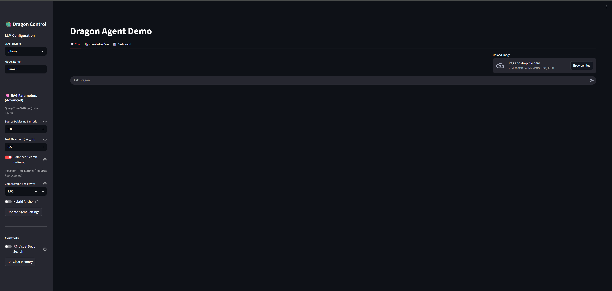

# 🐲 Dragon Demo: Multimodal RAG Agent

[](https://www.python.org/)
[](https://streamlit.io/)
[]()

**Dragon** is an experimental multimodal agent that uses a custom neural architecture to compress text and visual information into a unified memory space. Unlike standard RAG systems that store raw embeddings, Dragon uses **Semantic Chunking** and **Resonant Pointers** to maintain high retrieval accuracy with reduced memory footprints, specifically optimized for long-context understanding.

This repository contains the **interactive GUI demo** and the **benchmark suite** validating the architecture against industry baselines (SBERT, CLIP).


*The Dragon Interface

---

## 🚀 Key Features

* **🧠 Neural Compression:** Uses `MultiPhaseResonantPointer` to compress text chunks into dense vectors.
* **👁️ Multimodal Vision:** Integrates **LLaVA** (for description) and **EasyOCR** (for text reading) into a single retrieval pipeline.
* **✂️ Semantic Chunking:** Implements smart sentence-boundary detection to prevent context fragmentation (an improvement over fixed-size sliding windows).
* **⚖️ Fair Benchmarking:** Includes a unified suite (`bench_dragon_suite.py`) to compare Dragon against SBERT and CLIP on official datasets (SciFact, LoCo, Flickr30k).

---

## 🛠️ Installation & Setup

### 1. Clone & Install
```bash
git clone [https://github.com/Freeky7819/dragon_demo.git](https://github.com/Freeky7819/dragon_demo.git)
cd dragon_demo
pip install -r requirements.txt
2. Setup Ollama (Required for Vision)
Dragon uses Llama-3 for reasoning and LLaVA for vision. You must have Ollama installed.

Bash

ollama pull llama3
ollama pull llava
3. Run the GUI
Bash

streamlit run app.py
Access the interface at http://localhost:8501

📊 Benchmark Results
We evaluated Dragon against standard baselines (SBERT for text, CLIP for vision) using strict "fair comparison" protocols.

1. Text Retrieval Efficiency
Comparison of retrieval recall (R@10) on short facts (SciFact) and long documents (LoCoV1/Qasper).

Insight: Dragon maintains 97% of the baseline performance on long-context tasks (LoCo) while using compressed vector representations. The drop in short-text (SciFact) is an expected trade-off for compression density.

2. Vision Pipeline (Logic vs. Reality)
Comparison of Image-to-Text retrieval (R@1) on Flickr30k.

Logic Test: Dragon creates embeddings from Ground Truth captions (Ideal scenario).

Real World: Dragon generates descriptions via LLaVA + OCR (Actual Agent performance).

Insight: When fed accurate descriptions (Logic Test), Dragon performs on par with CLIP (0.66 vs 0.68), validating the search architecture. The drop in "Real World" mode reflects the current limitations of VLM description generation (LLaVA), not the retrieval engine itself.

🧪 Reproducing Benchmarks
To verify these results, run the unified benchmark suite using the following PowerShell commands. This script automatically handles dataset downloads (HuggingFace) and metric calculation.

PowerShell

# Install dependencies
pip install datasets open_clip_torch psutil pandas

# 1. Text Retrieval (Short & Long Context)
python bench_dragon_suite.py beir --dataset BeIR/scifact --max-docs 1000 --max-queries 200 --json-file results_beir.json
python bench_dragon_suite.py loco --loco-task qasper_abstract --max-docs 500 --max-queries 100 --json-file results_loco.json

# 2. Vision Retrieval (Logic & E2E Pipeline)
python bench_dragon_suite.py vision --mode caption --dataset nlphuji/flickr30k --max-images 500 --max-queries 500 --json-file results_vision_caption.json
python bench_dragon_suite.py vision --mode e2e --dataset nlphuji/flickr30k --max-images 50 --max-queries 50 --json-file results_vision_e2e.json
📂 Repository Structure
Plaintext

dragon_demo/
├── app.py                  # Main Streamlit GUI application
├── dragon_core.py          # Neural Network definitions (PyTorch)
├── dragon_brain.py         # Agent Logic (RAG, Hybrid Search, Vision Bridge)
├── bench_dragon_suite.py   # Unified Benchmark Runner
├── generate_plots.py       # Utility to visualize results
├── results/                # Raw JSON benchmark logs
└── assets/                 # Images and graphs
📜 License
MIT License.
